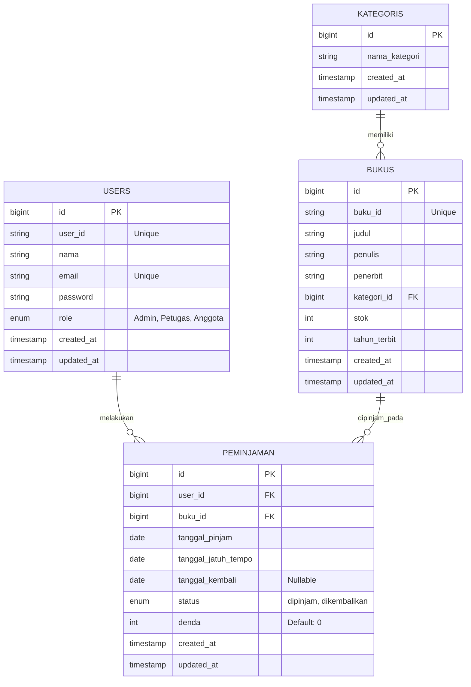

# Dokumen ERD dan Rancangan Skema Tabel
**Sistem Manajemen Perpustakaan Digital "Bacapedia"**

---

## 1. Entity Relationship Diagram (ERD)

Berikut adalah desain *Entity Relationship Diagram* (ERD) untuk sistem Bacapedia yang memvisualisasikan relasi antar entitas utama.

---

## 2. Rancangan Skema Tabel (Data Dictionary)

Berikut adalah rincian detail dari masing-masing tabel pada basis data relasional (`bacapedia_db`):

### A. Tabel `users`
Tabel ini digunakan untuk menyimpan seluruh data pengguna, termasuk Admin, Petugas, dan Anggota. Akses hak (otorisasi) dipisahkan berdasarkan kolom `role`.

| Nama Kolom | Tipe Data | Keterangan |
| :--- | :--- | :--- |
| `id` | `BIGINT(20) UNSIGNED` | **Primary Key**, Auto Increment |
| `user_id` | `VARCHAR(255)` | Unique, UUID untuk identifikasi publik |
| `nama` | `VARCHAR(255)` | Nama lengkap pengguna |
| `email` | `VARCHAR(255)` | Unique, Email pengguna untuk login |
| `password` | `VARCHAR(255)` | Kata sandi yang sudah di-*hash* (Bcrypt) |
| `role` | `ENUM` | Akses: `'Admin'`, `'Petugas'`, `'Anggota'` (Default: `'Anggota'`) |
| `created_at` | `TIMESTAMP` | Waktu pencatatan data dibuat |
| `updated_at` | `TIMESTAMP` | Waktu pencatatan data terakhir diubah |

---

### B. Tabel `kategoris`
Tabel ini menyimpan data kategori buku yang hanya dapat dikelola (CRUD) oleh Admin.

| Nama Kolom | Tipe Data | Keterangan |
| :--- | :--- | :--- |
| `id` | `BIGINT(20) UNSIGNED` | **Primary Key**, Auto Increment |
| `nama_kategori` | `VARCHAR(255)` | Nama kategori buku (contoh: "Fiksi", "Sains") |
| `created_at` | `TIMESTAMP` | Waktu pencatatan data dibuat |
| `updated_at` | `TIMESTAMP` | Waktu pencatatan data terakhir diubah |

---

### C. Tabel `bukus`
Tabel ini merepresentasikan entitas buku fisik maupun digital yang dapat dipinjam oleh Anggota. Entitas ini berelasi dengan tabel `kategoris` (Many-to-One).

| Nama Kolom | Tipe Data | Keterangan |
| :--- | :--- | :--- |
| `id` | `BIGINT(20) UNSIGNED` | **Primary Key**, Auto Increment |
| `buku_id` | `VARCHAR(255)` | Unique, UUID identitas buku |
| `judul` | `VARCHAR(255)` | Judul lengkap buku |
| `penulis` | `VARCHAR(255)` | Nama penulis buku |
| `penerbit` | `VARCHAR(255)` | Nama penerbit buku |
| `kategori_id` | `BIGINT(20) UNSIGNED`| **Foreign Key**, mereferensi `id` di tabel `kategoris` |
| `stok` | `INT(11)` | Jumlah ketersediaan fisik buku (Default: 0) |
| `tahun_terbit`| `YEAR(4)` | Tahun rilis penerbitan |
| `created_at` | `TIMESTAMP` | Waktu pencatatan data dibuat |
| `updated_at` | `TIMESTAMP` | Waktu pencatatan data terakhir diubah |

---

### D. Tabel `peminjamen` (Peminjaman)
Tabel transaksional ini mencatat semua pergerakan peminjaman buku. Berelasi dengan tabel `users` dan `bukus` (Many-to-One).

| Nama Kolom | Tipe Data | Keterangan |
| :--- | :--- | :--- |
| `id` | `BIGINT(20) UNSIGNED` | **Primary Key**, Auto Increment |
| `user_id` | `BIGINT(20) UNSIGNED`| **Foreign Key**, mereferensi `id` pada `users` (Anggota) |
| `buku_id` | `BIGINT(20) UNSIGNED`| **Foreign Key**, mereferensi `id` pada `bukus` |
| `tanggal_pinjam` | `DATE` | Tanggal disetujuinya peminjaman |
| `tanggal_jatuh_tempo`| `DATE` | Tanggal maksimal batas waktu pengembalian (7 Hari) |
| `tanggal_kembali` | `DATE` | Nullable, Diisi secara otomatis ketika buku dikembalikan |
| `status` | `ENUM` | Status transaksi: `'dipinjam'`, `'dikembalikan'` |
| `denda` | `INT(11)` | Nominal denda yang dihitung saat lewat batas waktu |
| `created_at` | `TIMESTAMP` | Waktu pencatatan data dibuat |
| `updated_at` | `TIMESTAMP` | Waktu pencatatan data terakhir diubah |

---
**Catatan Logika Relasional:**
- Ketika sebuah _kategori_ dihapus, seluruh _buku_ yang menggunakan kategori tersebut akan ikut terhapus secara otomatis (`ON DELETE CASCADE`).
- Ketika sebuah data _buku_ atau _user_ dihapus, riwayat _peminjamannya_ pada tabel peminjaman juga ikut terhapus demi menjaga integritas data (`ON DELETE CASCADE`).
