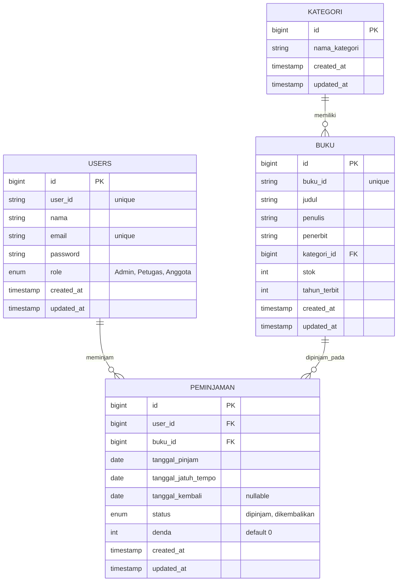

# Sistem Manajemen Perpustakaan Digital "Bacapedia"

Ini adalah repositori backend untuk Sistem Manajemen Perpustakaan Digital "Bacapedia", dibangun dengan Laravel 11. 
Sistem ini dibuat untuk memenuhi Tugas Praktek / Demonstrasi sertifikasi Backend Developer.

## Kebutuhan Sistem
- PHP >= 8.2
- Composer
- MySQL Database

## Cara Instalasi & Konfigurasi
1. Clone repositori ini.
2. Masuk ke direktori proyek:
   ```bash
   cd bacapedia-backend
   ```
3. Install dependensi dengan composer:
   ```bash
   composer install
   ```
4. Salin file environment dan atur kredensial database MySQL Anda:
   ```bash
   cp .env.example .env
   ```
   Buka file `.env` dan pastikan konfigurasi koneksi database Anda sesuai. Contoh:
   ```env
   DB_CONNECTION=mysql
   DB_HOST=127.0.0.1
   DB_PORT=3306
   DB_DATABASE=bacapedia_db
   DB_USERNAME=root
   DB_PASSWORD=
   ```
5. Buat database `bacapedia_db` di server MySQL lokal Anda.
6. Generate key aplikasi:
   ```bash
   php artisan key:generate
   ```
7. Jalankan migrasi database:
   ```bash
   php artisan migrate
   ```
8. Jalankan server backend:
   ```bash
   php artisan serve
   ```

## Entity Relationship Diagram (ERD)



## Daftar Endpoint API

### Autentikasi (Public)
*   **POST** `/api/register`
    *   *Body:* `nama`, `email`, `password`, `role` (Opsional, default Anggota. Pilihan: Admin, Petugas, Anggota).
*   **POST** `/api/login`
    *   *Body:* `email`, `password`
    *   *Response:* `access_token`, `token_type`, `role`.

*(Semua endpoint di bawah ini mewajibkan header `Authorization: Bearer <access_token>`)*

### Master Data Kategori (Hanya Admin)
*   **GET** `/api/kategoris` - Menampilkan semua kategori.
*   **POST** `/api/kategoris` - Membuat kategori baru.
*   **GET** `/api/kategoris/{id}` - Menampilkan detail kategori.
*   **PUT** `/api/kategoris/{id}` - Memperbarui kategori.
*   **DELETE** `/api/kategoris/{id}` - Menghapus kategori.

### Master Data Buku
*   **GET** `/api/bukus` - Menampilkan semua buku beserta kategorinya (Bisa diakses semua Role).
*   **GET** `/api/bukus/{id}` - Menampilkan detail buku. (Bisa diakses semua Role).
*   **POST** `/api/bukus` - Membuat buku baru (Hanya Admin).
*   **PUT** `/api/bukus/{id}` - Memperbarui data buku (Hanya Admin).
*   **DELETE** `/api/bukus/{id}` - Menghapus data buku (Hanya Admin).

### Proses Peminjaman & Pengembalian
*   **POST** `/api/peminjaman` (Role Anggota/Semua)
    *   *Body:* `buku_id`
    *   *Deskripsi:* Anggota meminjam buku. Berlaku batas maksimal 3 buku dan pengecekan ketersediaan stok buku.
*   **GET** `/api/peminjaman` (Role Semua)
    *   *Deskripsi:* Jika Anggota, hanya menampilkan riwayat peminjamannya sendiri. Jika Admin/Petugas, akan menampilkan semua riwayat peminjaman beserta info User dan Buku.
*   **POST** `/api/peminjaman/{id}/return` (Role Admin, Petugas)
    *   *Deskripsi:* Memproses pengembalian buku, mengecek keterlambatan (denda), dan menambah kembali stok buku.

## Kode Status HTTP
*   **200 OK / 201 Created:** Permintaan berhasil.
*   **400 Bad Request:** Input data tidak valid.
*   **401 Unauthorized:** Pengguna belum terautentikasi (Token tidak valid/tidak ada).
*   **403 Forbidden:** Pengguna tidak memiliki akses/role yang tepat untuk endpoint tersebut.
*   **404 Not Found:** Data yang dicari tidak ditemukan.
*   **409 Conflict / 422 Unprocessable Entity:** Validasi logika bisnis gagal (Contoh: Stok buku habis atau melebihi batas jumlah pinjaman).
